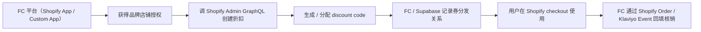
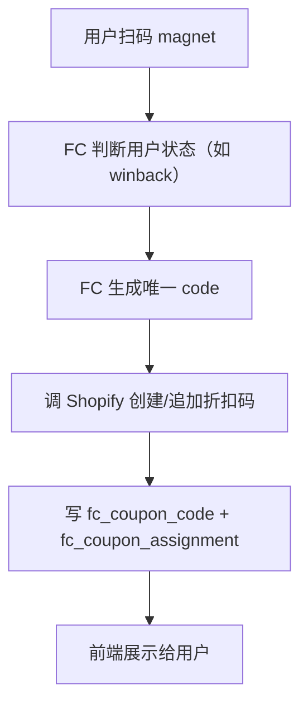
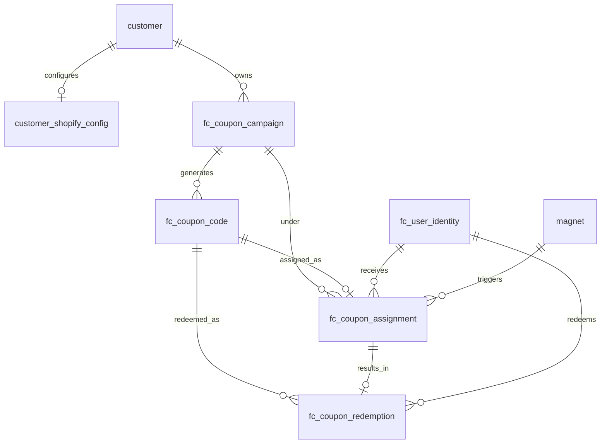
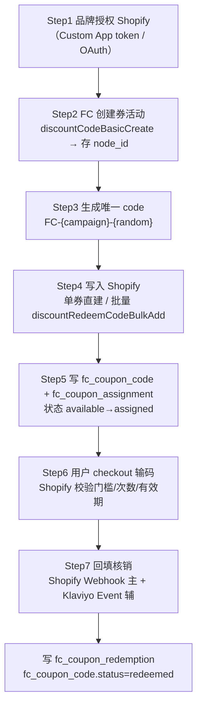
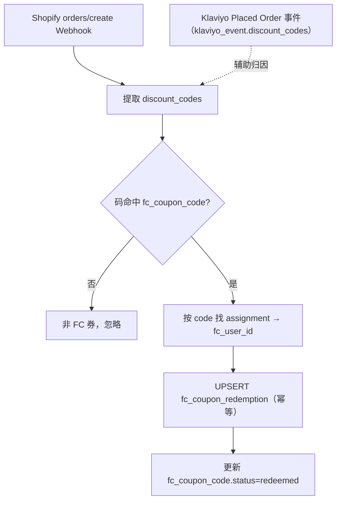

# FC 发券设计文档｜Shopify Discount 集成与券生命周期

<aside>
🎯

**目标**：FC 平台作为各品牌（租户）的 Shopify App，调 Shopify Admin GraphQL API 创建折扣码、分发给具体用户、并回填核销，沉淀为 FC 自有的「券活动 / 券码 / 分发 / 核销」四层数据。

**核心判断**：**券必须以 Shopify 为准**——创建、校验、核销都发生在 Shopify，FC 只做发放编排与归因记录。

**口径对齐**：品牌/租户 = `customer`（`customer_id`）；领取人 = `fc_user_id`（FK→`fc_user_identity`）；扫码触点 = `magnet_id`（FK→`magnet`）；密钥只存引用、不存明文。与 [Klaviyo 集成技术文档｜可获取信息清单 & 数据表设计](https://www.notion.so/Klaviyo-5a75639379f74e9bb09ddcc4ab824a76?pvs=21) 共用同一套身份与租户模型。

</aside>

## 0. 文档结构

1. 核心链路与设计判断
2. 集成模式（Custom App → OAuth）
3. Shopify 权限 scope
4. 发券的三种模式
5. 系统架构与现有数据模型的关系
6. 数据表设计（PostgreSQL DDL）
7. 端到端发券流程
8. 核销回填（Shopify Webhook 主 + Klaviyo Event 辅）
9. 服务方法 / 内部 API
10. Shopify 核心 GraphQL Mutation
11. 唯一券码生成规则
12. 项目目录结构
13. MVP 范围与落地顺序
14. 安全与合规

---

## 1. 核心链路与设计判断



<aside>
✅

**三条边界判断**（贯穿全文）：

1. **只做带码折扣（Code Discount）**，不做自动折扣——否则无法做「一人一券」与 `magnet` 归因。
2. **Shopify 是券的权威源**，FC 库只是分发与归因镜像；冲突以 Shopify 为准。
3. **Klaviyo 不是券中心**：Klaviyo 只用于判断用户状态（发不发、发哪种）与营销触达，核销事实以 Shopify 订单为准。
</aside>

---

## 2. 集成模式（Custom App → OAuth）

| 阶段 | 模式 | 品牌侧操作 | FC 拿到 | 定位 |
| --- | --- | --- | --- | --- |
| **MVP** | 每品牌一个 **Custom App** | Shopify 后台创建 Custom App，把 token 给 FC | `Admin API access token`  • `shop_domain` | **先用**：开发最快，适合早期品牌验证 |
| 正式 | FC 做 **Shopify OAuth App** | 点击 `Connect Shopify` 授权 | `shop`  • `access_token`  • `scopes` | 升级：标准 SaaS 接入、多品牌、可上 App Store |
- 两种模式拿到的凭证**都落到同一张 `customer_shopify_config`（见 6.1），只是 `auth_type` 不同**，业务层无感知。
- 无论哪种模式，**token 只存密钥系统引用（`access_token_ref`），库里绝不存明文**。

---

## 3. Shopify 权限 scope

| scope | 用途 | 本期 |
| --- | --- | --- |
| `write_discounts` | 创建折扣码 / 追加唯一码 | ✅ 必须 |
| `read_discounts` | 查询 FC 创建的券状态 | ✅ 必须 |
| `read_orders` | 查订单是否用了券（核销回填） | ✅ 必须 |
| `read_customers` | 绑定 Shopify customer | ✅ 必须 |
| `write_price_rules` | 旧 REST PriceRule 场景 | ❌ 先不用 |

<aside>
💡

**优先用 GraphQL Admin API 的 discount mutations**，不要走旧 REST `PriceRule`。

</aside>

---

## 4. 发券的三种模式

| 模式 | 做法 | 适用 | 本期定位 |
| --- | --- | --- | --- |
| **① 实时单券** | 用户扫码/完成任务后，立即创建一张唯一折扣码 | NFC（`magnet`）扫码领券、任务发券、状态触发 | **MVP 主力** |
| ② 批量唯一码 | 先建一个 Discount，再用 `discountRedeemCodeBulkAdd` 批量灌唯一码（每次 ≤ 250） | 给上万 winback 用户每人一码、Klaviyo 邮件发券 | 规模化（次阶段） |
| ③ 自动折扣 | 无需输码，`discountAutomaticBasicCreate` | — | **不建议**：无法一人一券、无法 `magnet` 归因、用户感知弱 |



---

## 5. 系统架构与现有数据模型的关系

```
customer（品牌/租户，FC 已有）
  ├─ customer_shopify_config      品牌 Shopify 接入配置（1:1）
  └─ fc_coupon_campaign           券活动
        └─ fc_coupon_code         券码（每码一行）
              └─ fc_coupon_assignment   发给了谁（fc_user_id / magnet_id）
                    └─ fc_coupon_redemption  是否被核销
```

<aside>
🔗

**与 Klaviyo 文档复用的实体**：

- `customer` / `customer_id`：同一套品牌/租户隔离键。
- `fc_user_identity` / `fc_user_id`：券的领取人、核销人统一用它，不再引入 UUID 版用户键。
- `magnet` / `magnet_id`：NFC 扫码触点（原方案的 `nfc_id` 一律改为 `magnet_id`）。
- `klaviyo_event`：核销归因的**辅助来源**——`klaviyo_event.discount_codes` 里的码可与 `fc_coupon_code.code` 关联（见第 8 节）。
</aside>

---

## 6. 数据表设计（PostgreSQL DDL）

> 设计原则与 Klaviyo 文档一致：①所有表带 `customer_id` 做租户隔离，FK→`customer(customer_id)`；②外部用户一律用 `fc_user_id`（TEXT）；③凭证只存引用；④Shopify 侧 ID（discount node / order）原样落地，便于回查。
> 

### 6.0 实体关系



### 6.1 品牌 Shopify 接入配置 `customer_shopify_config`

**作用**：按品牌存放 Shopify 接入凭证与店铺信息，与 `customer` 1:1；对标 `customer_klaviyo_config`，集成配置全部收敛到这里，不污染核心 `customer` 表。

```sql
CREATE TABLE customer_shopify_config (
  customer_id        TEXT PRIMARY KEY REFERENCES customer(customer_id), -- 品牌/租户（1:1）
  shop_domain        TEXT NOT NULL,              -- Shopify 店铺域名 xxx.myshopify.com
  shopify_shop_id    TEXT,                       -- Shopify 店铺数字 ID
  auth_type          TEXT DEFAULT 'custom_app',  -- 接入方式：custom_app / oauth
  access_token_ref   TEXT NOT NULL,              -- Admin API token 的密钥引用（Vault/KMS，禁存明文）
  scopes             TEXT[] DEFAULT '{}',        -- 已授予 scope
  api_version        TEXT DEFAULT '2025-04',     -- 绑定的 Shopify Admin API 版本
  webhook_secret_ref TEXT,                       -- orders/create Webhook 验签密钥引用
  status             TEXT DEFAULT 'active',      -- active / paused / revoked
  installed_at       TIMESTAMPTZ,                -- 授权/安装时间
  created_at         TIMESTAMPTZ DEFAULT now(),  -- 记录创建时间
  updated_at         TIMESTAMPTZ DEFAULT now(),  -- 记录更新时间
  UNIQUE (shop_domain)                           -- 一个店铺只绑定一个品牌
);
```

<aside>
🔐

**安全**：`access_token_ref` / `webhook_secret_ref` 只存**密钥管理系统（Vault/KMS/Secrets Manager）的引用键**，绝不在库里存明文 token；运行时按引用换真实凭证。与 Klaviyo 文档的密钥约定保持一致。

</aside>

### 6.2 券活动 `fc_coupon_campaign`

**作用**：一条 campaign 对应一个业务券活动（如「FC Winback 15% Off」），并绑定 Shopify 上对应的 Discount Code Node。

```sql
CREATE TABLE fc_coupon_campaign (
  campaign_id         UUID PRIMARY KEY DEFAULT gen_random_uuid(), -- 活动主键
  customer_id         TEXT NOT NULL REFERENCES customer(customer_id), -- 品牌/租户
  name                TEXT NOT NULL,             -- 活动展示名（FC Winback 15% Off）
  campaign_key        TEXT NOT NULL,             -- 业务键（winback_15），代码引用用
  discount_type       TEXT NOT NULL,             -- percentage / fixed_amount / free_shipping
  value               NUMERIC,                   -- 折扣值（百分比或金额；免邮可空）
  currency_code       TEXT,                      -- 固定金额折扣的币种
  min_purchase_amount NUMERIC,                   -- 最低消费门槛
  starts_at           TIMESTAMPTZ,               -- 活动开始
  ends_at             TIMESTAMPTZ,               -- 活动结束
  usage_limit         INTEGER,                   -- 单码使用次数上限
  once_per_customer   BOOLEAN DEFAULT true,      -- 每人限用一次
  shopify_discount_node_id TEXT,                 -- Shopify Discount Code Node id（创建后回写）
  shopify_discount_title   TEXT,                 -- Shopify 折扣标题
  status              TEXT DEFAULT 'draft',      -- draft / active / paused / expired
  created_at          TIMESTAMPTZ DEFAULT now(), -- 记录创建时间
  updated_at          TIMESTAMPTZ DEFAULT now(), -- 记录更新时间
  UNIQUE (customer_id, campaign_key)             -- 同品牌内业务键唯一
);
```

### 6.3 券码 `fc_coupon_code`

**作用**：每一个真实 code 一行，记录其 Shopify 侧标识与生命周期状态。

```sql
CREATE TABLE fc_coupon_code (
  coupon_code_id     UUID PRIMARY KEY DEFAULT gen_random_uuid(), -- 券码主键
  customer_id        TEXT NOT NULL REFERENCES customer(customer_id), -- 品牌/租户
  campaign_id        UUID NOT NULL REFERENCES fc_coupon_campaign(campaign_id) ON DELETE CASCADE, -- 所属活动
  code               TEXT NOT NULL,              -- 实际券码（FC-WB-7G9K2P）
  shopify_discount_node_id TEXT,                 -- 所属 Shopify Discount Node
  shopify_redeem_code_id   TEXT,                 -- Shopify redeem code id
  status             TEXT DEFAULT 'available',   -- available / assigned / redeemed / expired / disabled
  assigned_at        TIMESTAMPTZ,                -- 分配时间
  redeemed_at        TIMESTAMPTZ,                -- 核销时间
  expires_at         TIMESTAMPTZ,                -- 过期时间
  created_at         TIMESTAMPTZ DEFAULT now(),  -- 记录创建时间
  UNIQUE (customer_id, code)                     -- 品牌内码唯一
);
CREATE INDEX idx_coupon_code_campaign ON fc_coupon_code(customer_id, campaign_id); -- 按活动查码
CREATE INDEX idx_coupon_code_status   ON fc_coupon_code(customer_id, status);      -- 按状态查码
```

### 6.4 券分发 `fc_coupon_assignment`

**作用**：记录「这张券发给了谁、为什么发、通过什么渠道发」。**领取人用 `fc_user_id`、扫码触点用 `magnet_id`**（替换原方案的 UUID 用户键与 `nfc_id`）。

```sql
CREATE TABLE fc_coupon_assignment (
  assignment_id      UUID PRIMARY KEY DEFAULT gen_random_uuid(), -- 分发主键
  customer_id        TEXT NOT NULL REFERENCES customer(customer_id), -- 品牌/租户
  campaign_id        UUID NOT NULL REFERENCES fc_coupon_campaign(campaign_id) ON DELETE CASCADE, -- 活动
  coupon_code_id     UUID NOT NULL REFERENCES fc_coupon_code(coupon_code_id) ON DELETE CASCADE,   -- 券码
  fc_user_id         TEXT REFERENCES fc_user_identity(fc_user_id), -- 领取人（统一主键）
  magnet_id          TEXT REFERENCES magnet(magnet_id),            -- 触发领取的磁贴（NFC→magnet）
  email              TEXT,                       -- 冗余邮箱（对齐/补偿用）
  klaviyo_profile_id TEXT,                        -- 选填，便于 Klaviyo 侧归因
  shopify_customer_id TEXT,                       -- 选填，Shopify 顾客
  channel            TEXT,                        -- magnet / email / sms / web / qr / klaviyo
  assignment_reason  TEXT,                        -- winback / new_customer / vip / task_completed
  assigned_at        TIMESTAMPTZ DEFAULT now(),   -- 分发时间
  UNIQUE (customer_id, campaign_id, fc_user_id)    -- 同活动一人一张
);
CREATE INDEX idx_coupon_assignment_user ON fc_coupon_assignment(customer_id, fc_user_id); -- 按用户查发券记录
```

<aside>
💡

**唯一约束从「邮箱」改为「`fc_user_id`」**：FC 内部用户主键比邮箱更稳定，也与全局以 `fc_user_id` 为关联键的口径一致。匿名/未注册场景可在 `fc_user_identity` 先建占位用户再发券。

</aside>

### 6.5 券核销 `fc_coupon_redemption`

**作用**：记录券是否真的被用掉，来源可为 Shopify Webhook（主）或 Klaviyo Event（辅）。

```sql
CREATE TABLE fc_coupon_redemption (
  redemption_id      UUID PRIMARY KEY DEFAULT gen_random_uuid(), -- 核销主键
  customer_id        TEXT NOT NULL REFERENCES customer(customer_id), -- 品牌/租户
  coupon_code_id     UUID REFERENCES fc_coupon_code(coupon_code_id), -- 券码
  assignment_id      UUID REFERENCES fc_coupon_assignment(assignment_id), -- 对应分发
  fc_user_id         TEXT REFERENCES fc_user_identity(fc_user_id),   -- 核销归属用户
  code               TEXT NOT NULL,              -- 核销使用的码
  shopify_order_id   TEXT,                       -- Shopify 订单 ID
  shopify_order_name TEXT,                       -- Shopify 订单号（#1001）
  customer_email     TEXT,                       -- 下单邮箱
  shopify_customer_id TEXT,                      -- Shopify 顾客
  order_total        NUMERIC,                    -- 订单金额
  total_discounts    NUMERIC,                    -- 折扣总额
  currency_code      TEXT,                       -- 币种
  redeemed_at        TIMESTAMPTZ,                -- 核销时间
  source             TEXT,                       -- shopify_webhook / klaviyo_event / manual_sync
  raw_order          JSONB,                      -- 原始订单留档
  created_at         TIMESTAMPTZ DEFAULT now(),  -- 记录创建时间
  UNIQUE (customer_id, code, shopify_order_id)   -- 同码同单只核销一次（幂等）
);
```

### 6.6 字段 → 落地表映射总表

| 业务问题 | 数据来源 | 落地表.列 |
| --- | --- | --- |
| 品牌 Shopify 怎么连 | Custom App / OAuth 授权 | `customer_shopify_config` |
| 有哪些券活动 | FC 创建 + Shopify discount | `fc_coupon_campaign` |
| 有哪些码、什么状态 | FC 生成 + Shopify redeem code | `fc_coupon_code` |
| 券发给了谁、为什么、走哪个渠道 | FC 分发逻辑 | `fc_coupon_assignment`（`fc_user_id` / `magnet_id`） |
| 券有没有被用掉 | Shopify Order Webhook（主）/ Klaviyo Event（辅） | `fc_coupon_redemption` |
| 用券的人是谁（归因） | 码 → 分发 → 用户 | `fc_coupon_redemption.fc_user_id` |

---

## 7. 端到端发券流程



---

## 8. 核销回填（Shopify Webhook 主 + Klaviyo Event 辅）



<aside>
⚠️

**为什么 Shopify Webhook 为主、Klaviyo 为辅**：

- Shopify 是订单与核销的**事实源**，`orders/create` 携带准确的 `discount_codes` / `total_discounts` / `order_id`。
- Klaviyo 的 `Placed Order` 事件有同步延迟，且只给「码字符串 + 折扣总额」、不区分券类型（见 Klaviyo 文档 2.4 的限制）。
- 因此 **核销以 Shopify 为准；Klaviyo Event 仅作交叉校验与营销侧归因**。两条来源都通过 `UNIQUE(customer_id, code, shopify_order_id)` 去重，不会重复核销。
</aside>

---

## 9. 服务方法 / 内部 API

虽然本期不对外开放数据接口，发券功能至少需要三个内部服务方法：

```tsx
// ① 创建券活动
createCouponCampaign({
  customerId,                 // 品牌/租户
  campaignKey: "winback_15",
  name: "FC Winback 15% Off",
  discountType: "percentage", // percentage / fixed_amount / free_shipping
  value: 15,
  startsAt, endsAt,
  oncePerCustomer: true,
})
// 内部：读 customer_shopify_config 取 token → discountCodeBasicCreate
//      → 存 shopify_discount_node_id → 写 fc_coupon_campaign

// ② 给用户分配券
assignCouponToUser({
  customerId,
  campaignKey: "winback_15",
  fcUserId,                   // 统一用 fc_user_id
  magnetId,                   // 扫码触点（可选）
  reason: "winback",
  channel: "magnet",
})
// 内部：查 campaign → 查该 fc_user_id 是否已领（UNIQUE 约束）
//      → 生成唯一 code → 写入 Shopify（单券或 bulkAdd）
//      → 写 fc_coupon_code + fc_coupon_assignment → 返回 code

// ③ 同步核销
syncCouponRedemptionFromOrder(order)
// 内部：提取 discount code → 查 fc_coupon_code → 命中则写 fc_coupon_redemption
//      → 更新 fc_coupon_code.status = 'redeemed'
```

---

## 10. Shopify 核心 GraphQL Mutation

### 10.1 创建百分比 / 固定金额券 `discountCodeBasicCreate`

需 `write_discounts` scope；创建用户输入 code 后在 cart / checkout 生效的折扣。([Shopify 文档](https://shopify.dev/docs/api/admin-graphql/latest/mutations/discountcodebasiccreate))

```graphql
mutation discountCodeBasicCreate($basicCodeDiscount: DiscountCodeBasicInput!) {
  discountCodeBasicCreate(basicCodeDiscount: $basicCodeDiscount) {
    codeDiscountNode {
      id
      codeDiscount {
        ... on DiscountCodeBasic {
          title
          startsAt
          endsAt
          codes(first: 10) { nodes { code } }
        }
      }
    }
    userErrors { field message }
  }
}
```

```json
{
  "basicCodeDiscount": {
    "title": "FC Winback 15% Off",
    "code": "FC-WINBACK-15",
    "startsAt": "2026-06-10T00:00:00Z",
    "endsAt": "2026-07-10T00:00:00Z",
    "customerSelection": { "all": true },
    "customerGets": {
      "value": { "percentage": 0.15 },
      "items": { "all": true }
    },
    "appliesOncePerCustomer": true
  }
}
```

> 保存返回的 `codeDiscountNode.id` 到 `fc_coupon_campaign.shopify_discount_node_id`，后续追加唯一码用它。
> 

### 10.2 批量追加唯一码 `discountRedeemCodeBulkAdd`

向一个 Discount Code Node 异步添加多个 codes，**每次最多 250 个**，适合 Klaviyo 邮件/分群批量发券。([Shopify 文档](https://shopify.dev/docs/api/admin-graphql/latest/mutations/discountRedeemCodeBulkAdd))

```graphql
mutation discountRedeemCodeBulkAdd($discountId: ID!, $codes: [DiscountRedeemCodeInput!]!) {
  discountRedeemCodeBulkAdd(discountId: $discountId, codes: $codes) {
    bulkCreation { id }
    userErrors { field message }
  }
}
```

```json
{
  "discountId": "gid://shopify/DiscountCodeNode/1234567890",
  "codes": [
    { "code": "FC-WB-A1B2C3" },
    { "code": "FC-WB-D4E5F6" }
  ]
}
```

### 10.3 创建免邮券 `discountCodeFreeShippingCreate`

用户输入 code 后生效的 free shipping discount，适合 VIP / Winback 免邮。([Shopify 文档](https://shopify.dev/docs/api/admin-graphql/latest/mutations/discountcodefreeshippingcreate))

<aside>
⚠️

**免邮归因坑（与 Klaviyo 文档 2.4 呼应）**：免邮折在运费上，Klaviyo `Placed Order` 的 `Total Discounts`（订单项折扣）常常不体现免邮金额。免邮券的核销请**以 Shopify 订单的 shipping discount 为准**，不要依赖 Klaviyo 折扣额。

</aside>

---

## 11. 唯一券码生成规则

```
格式：FC-{campaign_short}-{random}
示例：FC-WB-K82MDX   FC-VIP-FS-92KLP   FC-FIRST-10-7AXP
```

- `random` 用大写字母+数字、去除易混字符（0/O、1/I/L），长度 6–8 位。
- 生成后先 `INSERT ... ON CONFLICT DO NOTHING` 落 `fc_coupon_code`，命中冲突则重生成，保证 `UNIQUE(customer_id, code)`。
- 单券模式直接 `discountCodeBasicCreate`；批量模式先建活动再 `discountRedeemCodeBulkAdd`。

---

## 12. 项目目录结构

```
src/
├─ clients/
│  ├─ shopify.client.ts        # shopifyGraphql(shopDomain, token, query, variables)
│  ├─ klaviyo.client.ts
│  └─ supabase.client.ts
├─ shopify/
│  ├─ discount.api.ts          # discountCodeBasicCreate / bulkAdd / freeShipping
│  ├─ order.api.ts
│  └─ webhook.verify.ts        # orders/create 验签
├─ coupons/
│  ├─ create-campaign.ts
│  ├─ assign-coupon.ts
│  ├─ generate-code.ts
│  ├─ redeem-coupon.ts
│  └─ coupon.types.ts
├─ repositories/
│  ├─ customer-shopify-config.repo.ts
│  ├─ coupon-campaign.repo.ts
│  ├─ coupon-code.repo.ts
│  ├─ coupon-assignment.repo.ts
│  └─ coupon-redemption.repo.ts
└─ sync/
   ├─ sync-shopify-orders.ts
   └─ sync-coupon-redemptions.ts
```

---

## 13. MVP 范围与落地顺序

**第一版只做：**

```
券类型：percentage / fixed_amount / free_shipping
限制：  starts_at / ends_at、once_per_customer、min_purchase_amount
场景：  magnet 扫码领券、winback 用户领券
```

**第一版不做：** 复杂商品/集合范围、叠加规则、自动折扣、Shopify Functions 自定义折扣、多币种复杂规则。

**落地顺序：**

1. **品牌授权**：测试店建 Custom App，给 FC `shop_domain` + token（`write_discounts` / `read_discounts` / `read_orders` / `read_customers`），落 `customer_shopify_config`（token 入密钥系统、库存引用）。
2. **建表**：`customer_shopify_config` → `fc_coupon_campaign` → `fc_coupon_code` → `fc_coupon_assignment` → `fc_coupon_redemption`。
3. **Shopify Client**：封装 `shopifyGraphql()`。
4. **创建券活动**：跑通 `discountCodeBasicCreate`，Shopify 后台 Discounts 可见。
5. **分配唯一码**：`fc_user_id → 生成 code → Shopify 创建/追加 → 写 assignment`。
6. **订单回填**：先手动同步订单，再上 `orders/create` Webhook。
7. **多品牌**：升级为 Shopify OAuth App，避免手工收集各品牌 token。

---

## 14. 安全与合规

- Shopify Admin token / webhook secret **只存密钥系统引用**，绝不下发前端、不入库明文。
- `orders/create` Webhook 必须**验签**（HMAC），用 `customer_shopify_config.webhook_secret_ref`。
- 多品牌严格按 `customer_id` 隔离 token 与数据；一个品牌授权失效只标记该品牌，不影响其他品牌发券。
- 券码生成避免可枚举规律，配合 Shopify 侧 `once_per_customer` 与使用次数上限防滥用。
- 核销写库全程 `UPSERT` 幂等，Shopify 与 Klaviyo 双来源不重复计数。