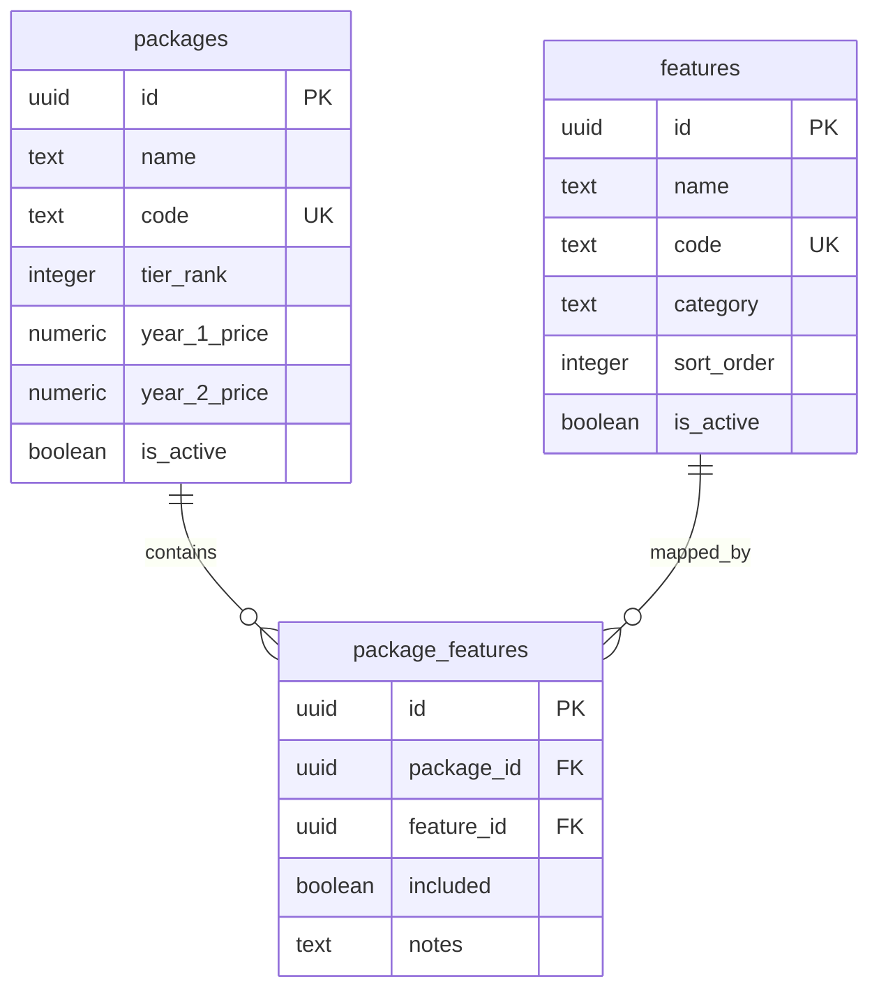

# packages / features / package_features 数据库字典

本文档描述销售套餐、功能项、套餐功能矩阵 3 张表。

## 1. packages - 销售套餐表

**表名**：`public.packages`

**用途**：存储销售套餐档位、价格、展示文案和启用状态。用于套餐展示、报价和功能矩阵关联。

**主键**：`id`

**唯一约束**：`code`

| 字段 | 类型 | 是否必填 | 默认值 | 说明 |
| --- | --- | --- | --- | --- |
| id | uuid | 是 | gen_random_uuid() | 主键 UUID |
| name | text | 是 | - | 套餐显示名称 |
| code | text | 是 | - | 套餐唯一编码，程序引用 |
| tier_rank | integer | 是 | - | 档位排序，数值越小通常表示越低档 |
| description | text | 否 | - | 套餐详细说明 |
| best_fit | text | 否 | - | 最适合的客户类型或使用场景 |
| year_1_price | numeric(10, 2) | 是 | - | 首年单价 |
| year_2_price | numeric(10, 2) | 是 | - | 续费第二年及以后单价 |
| currency | text | 是 | 'USD' | 价格货币代码 |
| billing_unit | text | 是 | 'Per Card / Year' | 计费单位说明 |
| is_active | boolean | 是 | true | 是否对外展示或可售 |
| created_at | timestamptz | 是 | now() | 记录创建时间 |
| updated_at | timestamptz | 是 | now() | 记录最后更新时间 |

**检查约束**

| 约束名 | 规则 |
| --- | --- |
| packages_tier_rank_check | tier_rank > 0 |
| packages_year_1_price_check | year_1_price >= 0 |
| packages_year_2_price_check | year_2_price >= 0 |

**索引**

| 索引名 | 字段 |
| --- | --- |
| idx_packages_tier_rank | tier_rank |

## 2. features - 产品功能项表

**表名**：`public.features`

**用途**：存储可展示在套餐对比矩阵中的功能项。功能按 category 分组，并通过 sort_order 控制分组内排序。

**主键**：`id`

**唯一约束**：`code`

| 字段 | 类型 | 是否必填 | 默认值 | 说明 |
| --- | --- | --- | --- | --- |
| id | uuid | 是 | gen_random_uuid() | 主键 UUID |
| name | text | 是 | - | 功能显示名称 |
| code | text | 是 | - | 功能唯一编码，程序引用 |
| category | text | 是 | - | 功能分类，用于分组展示 |
| description | text | 否 | - | 功能说明 |
| sort_order | integer | 是 | 0 | 同分类内排序，越小越靠前 |
| is_active | boolean | 是 | true | 是否在对比矩阵中展示 |
| created_at | timestamptz | 是 | now() | 记录创建时间 |
| updated_at | timestamptz | 是 | now() | 记录最后更新时间 |

**索引**

| 索引名 | 字段 |
| --- | --- |
| idx_features_category | category |

## 3. package_features - 套餐功能矩阵表

**表名**：`public.package_features`

**用途**：存储套餐与功能项之间的包含关系。每一行表示某个套餐是否包含某个功能，可用于渲染套餐对比表单元格。

**主键**：`id`

**唯一约束**：`(package_id, feature_id)`

| 字段 | 类型 | 是否必填 | 默认值 | 说明 |
| --- | --- | --- | --- | --- |
| id | uuid | 是 | gen_random_uuid() | 主键 UUID |
| package_id | uuid | 是 | - | 关联套餐 ID |
| feature_id | uuid | 是 | - | 关联功能 ID |
| included | boolean | 是 | false | 该套餐是否包含此功能 |
| notes | text | 否 | - | 补充说明，如限额、仅部分包含等 |
| created_at | timestamptz | 是 | now() | 记录创建时间 |
| updated_at | timestamptz | 是 | now() | 记录最后更新时间 |

**外键**

| 字段 | 引用表 | 引用字段 | 删除行为 |
| --- | --- | --- | --- |
| package_id | public.packages | id | ON DELETE CASCADE |
| feature_id | public.features | id | ON DELETE CASCADE |

**索引**

| 索引名 | 字段 |
| --- | --- |
| idx_package_features_package_id | package_id |
| idx_package_features_feature_id | feature_id |

## 表关系

`packages` 与 `features` 是多对多关系，通过 `package_features` 关联。

## 当前套餐功能包含规则

`package_features.included` 当前按以下规则生成：

| 套餐 code | included=true 规则 |
| --- | --- |
| PKG-PRESENCE | 仅包含 category = `In-Home Touchpoint` 的功能 |
| PKG-IHRA | 包含 `In-Home Touchpoint`、`Lifecycle Purchase Activation`、`Integrations & Measurement` 三类功能 |
| PKG-PPM | 包含全部功能 |

当前写入结果：

| 套餐 code | 功能总数 | included=true | included=false |
| --- | ---: | ---: | ---: |
| PKG-PRESENCE | 30 | 8 | 22 |
| PKG-IHRA | 30 | 22 | 8 |
| PKG-PPM | 30 | 30 | 0 |

