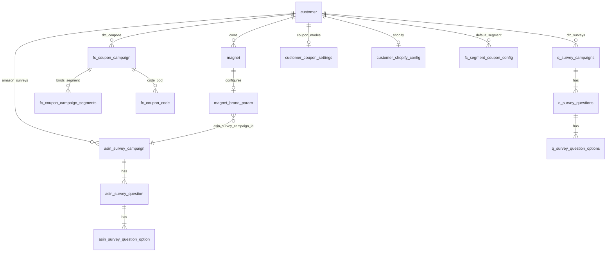

# Customer / Magnet 配置工具 — 库表与写入规范

面向：**新建 customer 后**，由独立工具拉取外部数据，按 `customer_id`、可选 `magnet_id`/`sn`、产品线 **DTC / Amazon（ASIN Plus）** 写入 Supabase。

与现网行为对齐：

- 物理卡事实源：`magnet`（`sn` 即 `/p/{sn}` 路由键）
- 卡级体验与展示配置：`magnet_brand_param.experience` → `GET /api/fc/experience/{sn}`
- ASIN Plus 落地页与问卷：`magnet_brand_param` + `asin_survey_*`（不依赖 `reorder_fc_unit` 发布链）
- DTC 问卷：`q_survey_*`（Tap-to-Choice；**不要**写 `reorder_version_group_id` 非空的 Reorder 遗留行）
- **DTC 可玩最小集**：brand_param + survey **不够**。必须有 **≥2 条**可 available 的券、realtime 出码可用、segment 绑定；游戏**不要**为每客户克隆——引擎消费端写死读 **customer_id = 5** 的 `game_instance`。详见 **§0 / §14**。

---

## 0. 工具目标：数据处理成什么样（总览）

新建 customer 后，工具应按 `line` 写出下列**结果态**（不是半成品）。

### 0.1 公共（两种 line 都要）

| 结果 | 表 / 字段 |
|------|-----------|
| 客户产品线 | `customer.product_line` ∈ `{dtc, asin_plus, both}` |
| 卡存在 | `magnet.id` + `magnet.sn` + `magnet.customer_id` |
| 品牌卡配置 | `magnet_brand_param`：`customer_id`、`magnet_id`、`magnet_sn`、`experience`、品牌字段与 URL（见 §5） |
| customer_id 对齐 | `magnet.customer_id` = `magnet_brand_param.customer_id` |

### 0.2 `line = dtc`（首页能玩）

工具必须落成：

| # | 结果态 | 表 |
|---|--------|-----|
| 1 | `experience = dtc` | `magnet_brand_param` |
| 2 | 发券开关打开 | `customer_coupon_settings.modes.realtime_single.enabled = true` |
| 3 | 默认人群 | `fc_segment_coupon_config`：`is_default=true`，`discount_type=percentage`，`is_active=true` |
| 4 | **≥2 条** active 百分比券 | `fc_coupon_campaign`（不同 `value`，如 10% + 15%） |
| 5 | 每条券绑默认 segment | `fc_coupon_campaign_segments` |
| 6 | 每条券有 available 码 | `fc_coupon_code.status=available`，数量建议 ≥20 |
| 7 | Shopify discount 已挂 | campaign **或** 每条 code 的 `shopify_discount_node_id` 非空（演示可借用测试店 node） |
| 8 | available ≥2 | `fc_list_available_coupon_campaigns(magnet_id).campaigns.length ≥ 2` |
| 9 | 可选问卷 | `q_survey_*`，`status=open`，`reorder_version_group_id is null` |
| 10 | **不写** `game_instance` | 消费端固定用 **customer 5** 游戏目录 |

**验收（DTC）：**

```
GET /api/fc/experience/{sn}                         → experience=dtc
rpc fc_list_available_coupon_campaigns(magnet_id)   → campaigns.length ≥ 2
GET /api/fc/reward-plan?touchId={sn}                → 200
  · initialReward.issued = true
  · targetRewardPack.coupons.length ≥ 1
  · tasks 含 type=game（来自 customer 5）
```

常见失败：

| 错误 | 缺什么 |
|------|--------|
| `COUPON_SET_EMPTY` | 券 / segment / allocatable 未齐，available=0 |
| `INITIAL_ISSUE_INCOMPLETE` | realtime 未开，或缺 `shopify_discount_node_id` |
| 有券无游戏/无礼包条 | available 只有 1 张（需要 ≥2）；或引擎未读到 customer 5 游戏 |

### 0.3 `line = asin_plus`（Amazon 落地页）

| # | 结果态 | 表 / 字段 |
|---|--------|-----------|
| 1 | `experience = asin_plus` | `magnet_brand_param` |
| 2 | 产品名 + PDP | `product_name`、`store_website`（主 CTA） |
| 3 | 店铺 URL | `website` |
| 4 | 产品图（建议） | `product_image_url` |
| 5 | 可选问卷 | `asin_survey_*` + `magnet_brand_param.asin_survey_campaign_id` |
| 6 | **Discount code（落地页券码）** | `magnet_brand_param.discount_claim_code` + `discount_benefit`（详见 [ASIN discount 更新文档](./2026-09-13-asin-plus-discount-code-provisioning.md)） |
| 7 | **不要**为 ASIN 写 DTC 券/游戏 | 走 `/api/reorder/consumer/{sn}`，不依赖 reward-plan |

**验收（ASIN）：**

```
GET /api/fc/experience/{sn}              → asin_plus
GET /api/reorder/consumer/{sn}           → state=ready, product + availableSavings[].claimCode + optional survey
```
### 0.4 工具不要做的事

- **不要**给每个新 customer 克隆 `game_instance`（引擎已共享 customer 5）
- **不要**把 ASIN survey 写进 `q_survey_*`（或写了必须 `reorder_version_group_id is null` 且仅 DTC 用）
- **不要**只建 1 张券就期望完整任务/目标礼包 UI
- **不要**假设 `bulk_unique.enabled` 能替代 `realtime_single`（首发礼包只走 realtime-single API）
- `customer_shopify_config.shop_domain` **全局唯一**：多客户演示优先只挂 `shopify_discount_node_id`，勿重复插入同一 shop_domain

---

## 1. 工具入参约定

| 参数 | 必填 | 说明 |
|------|------|------|
| `customer_id` | 是 | `customer.id` |
| `line` | 是 | `dtc` \| `asin_plus`（对应 `magnet_brand_param.experience`） |
| `magnet_id` | 否 | 已知则直接绑定 |
| `sn` | 否 | 与 `magnet_id` 二选一或同时给；写入前 `upper(trim(sn))` |
| `mode` | 否 | `bind_now`（默认）\| `placeholder`（先占位，后绑卡） |

**解析顺序（建议）：**

1. 若提供 `magnet_id` → 读 `magnet`，校验 `magnet.customer_id = customer_id`，取 `sn`
2. 否则若提供 `sn` → 读 `magnet` by sn，校验 `customer_id`
3. 否则 `placeholder` → 仅写 `magnet_brand_param`，`magnet_id` / `magnet_sn` 为空，用 `(customer_id, experience)` 定位行后再更新

---

## 2. 表关系总览



**控制台权限（与库表独立）：**

- `customer.product_line`：`dtc` \| `asin_plus` \| `both` — 仅 Dashboard 导航/能力，**不**替代卡级 `experience`

---

## 3. `customer`

| 列 | 类型 | 工具写入 |
|----|------|----------|
| `id` | bigint | 新建 customer 后得到 |
| `product_line` | text | `dtc` / `asin_plus` / `both`，与商务开通一致 |

```sql
-- 示例
update public.customer
set product_line = 'both'
where id = :customer_id;
```

---

## 4. `magnet`（物理卡）

| 列 | 类型 | 工具写入 |
|----|------|----------|
| `id` | bigint | 库分配或外部同步 |
| `sn` | text | **唯一**，大写，即 FC ID |
| `customer_id` | bigint | 必须等于工具的 `customer_id` |
| `url` | text | 可选 |

绑卡阶段：

```sql
-- 工具在拿到 sn 后
update public.magnet_brand_param mbp
set
  magnet_id = m.id,
  magnet_sn = upper(btrim(m.sn)),
  customer_id = m.customer_id  -- 建议与 magnet 对齐
from public.magnet m
where mbp.id = :brand_param_id
  and m.id = :magnet_id
  and m.customer_id = :customer_id;
```

---

## 5. `magnet_brand_param`（核心配置行）

### 5.1 现网已有列（工具应全部持久化）

| 列 | DTC 语义 | ASIN Plus 语义 | 必填建议 |
|----|----------|----------------|----------|
| `id` | PK，自增 | 同左 | 插入时不填 |
| `customer_id` | 租户 | 租户 | **是**（现网已有；绑卡后与 `magnet.customer_id` 一致） |
| `magnet_id` | 卡 ID | 卡 ID | 占位模式可空（见 §8） |
| `magnet_sn` | 卡 SN | 卡 SN | 占位模式可空 |
| `experience` | `dtc` | `asin_plus` | **是** |
| `brand_name` | 品牌名 | 品牌名 | 是 |
| `brand_logo` | Logo URL | Logo URL | 建议 |
| `primary_color` | 主题色 | 主题色 | 可选 |
| `secondary_color` | 辅色 | 辅色 | 可选 |
| `website` | 品牌官网 / 店铺根地址 | **Amazon 店铺/Brand Store URL** | ASIN 建议填 |
| `store_website` | **Shopify 商品 PDP** | **Amazon 商品 PDP（主 CTA）** | ASIN **必填**（consumer ready） |
| `product_name` | 可选展示名 | 商品标题 | ASIN **必填** |
| `product_image_url` | 可选 | 商品主图 URL | ASIN 建议 |
| `asin_survey_campaign_id` | `NULL` | 绑 `asin_survey_campaign.id` | 有问卷则填 |
| `discount_benefit` | — | 券利益点文案，如 `Save 10%` | 有码建议填 |
| `discount_claim_code` | — | Amazon **group** claim code | **有码必填** |
| `discount_asin` | — | 可选 ASIN；空则解析 PDP URL | 建议 |
| `discount_ends_at` | — | 可选截止日期 | 可选 |
| `created_at` | 系统 | 系统 | 默认 |

**Consumer 判定（ASIN Plus，现网代码）：**

- `experience = asin_plus` 且 `product_name` + `store_website` 非空 → 可出落地页
- 另有 `asin_survey_campaign_id` 且 campaign `status = open` → 出 Quick survey
- 另有 `discount_claim_code` → `availableSavings` 含该 group code，落地页展示 Code

折扣专项说明：[2026-09-13-asin-plus-discount-code-provisioning.md](./2026-09-13-asin-plus-discount-code-provisioning.md)
### 5.2 建议新增列（工具长期方案）

现网 **DTC 问卷未** 在 `magnet_brand_param` 上绑 FK；Tap 按 `magnet_id` + `customer_id` 在 `q_survey_campaigns` 里解析。若工具需要「每卡一条配置 + 指定 DTC 问卷」，建议 migration：

```sql
-- 建议新增（工具文档先行；应用侧后续接字段）
alter table public.magnet_brand_param
  add column if not exists dtc_survey_campaign_id uuid
    references public.q_survey_campaigns(id) on delete set null;

comment on column public.magnet_brand_param.dtc_survey_campaign_id is
  'Optional DTC Tap survey; when set, tooling/API can prefer this campaign for the magnet';
```

在应用未接之前：DTC 仍靠 **customer 级** `q_survey_campaigns`（`status = open`，`reorder_version_group_id is null`）+ `audience_type = all_users` 或 segment。

### 5.3 占位行定位 SQL

```sql
select *
from public.magnet_brand_param
where customer_id = :customer_id
  and experience = :line   -- 'dtc' | 'asin_plus'
  and magnet_id is null
order by id desc
limit 1;
```

若同一 customer 需要 **多条** 同 experience 占位（多批卡），建议再加 migration：

```sql
-- 可选：工具外部 ID，避免只靠 (customer_id, experience) 歧义
alter table public.magnet_brand_param
  add column if not exists provisioning_key text;

create unique index if not exists magnet_brand_param_provisioning_key_uidx
  on public.magnet_brand_param (customer_id, provisioning_key)
  where provisioning_key is not null;
```

---

## 6. DTC Survey（`q_survey_*`）

### 6.1 涉及表

| 表 | 作用 |
|----|------|
| `q_survey_campaigns` | 活动主表 |
| `q_survey_questions` | 题目 |
| `q_survey_question_options` | 选项 |
| `q_survey_campaign_segments` | 可选，按 Klaviyo segment 投放 |

### 6.2 工具写入要点

**Campaign（`q_survey_campaigns`）**

| 列 | 工具建议值 |
|----|------------|
| `customer_id` | `customer_id` |
| `survey_name` / `name` | 对外标题 |
| `status` | 草稿 `draft` → 上线 `open` |
| `reorder_version_group_id` | **必须 NULL**（DTC 与 Reorder 隔离） |
| `audience_type` | 全量卡：`all_users`；否则配 segments |
| `start_at` / `end_at` | 按排期 |
| `scope_type` | 与 Dashboard 创建逻辑一致 |

**Question（`q_survey_questions`）**

| 列 | 说明 |
|----|------|
| `survey_campaign_id` | 上一步 campaign UUID |
| `question_text` | 题干 |
| `question_type` | 如 `single_choice` |
| `display_order` | 0..n |
| `is_required` | boolean |
| `status` | `active` 才可被 Tap 拉到 |

**Option（`q_survey_question_options`）**

| 列 | 说明 |
|----|------|
| `survey_question_id` | 题目 UUID |
| `label` / `value` | 展示与存储 |
| `display_order` | 排序 |
| `status` | `active` |

### 6.3 与 `magnet_brand_param` 的关系

| 模式 | 做法 |
|------|------|
| **当前现网** | 不绑 FK；保证 campaign 的 `customer_id` 正确且 `open`，Tap 用 `magnet_id` 解析 |
| **推荐（§5.2）** | 创建 campaign 后 `update magnet_brand_param set dtc_survey_campaign_id = :id` |

---

## 7. Amazon / ASIN Plus Survey（`asin_survey_*`）

### 7.1 涉及表

| 表 | 作用 |
|----|------|
| `asin_survey_campaign` | 活动 |
| `asin_survey_question` | 题目 |
| `asin_survey_question_option` | 选项 |
| `asin_survey_response` | C 端答题（工具一般不预写） |

### 7.2 写入顺序

1. `insert asin_survey_campaign`（`customer_id`，`status`：`draft` → `open`）
2. `insert asin_survey_question`（**每题带相同 `customer_id`**）
3. `insert asin_survey_question_option`
4. `update magnet_brand_param set asin_survey_campaign_id = campaign.id`

**硬约束：** campaign / question / option 的 `customer_id` 必须一致；绑卡后建议与 `magnet.customer_id` 一致（避免 consumer 查不到问卷）。

### 7.3 Campaign 字段

| 列 | 说明 |
|----|------|
| `title` | Consumer `survey.title` |
| `description` | 完成页/描述文案 |
| `status` | `open` 才会出现在 `/api/reorder/consumer/{sn}` |
| `product_version_id` | 可选，Reorder 目录 UUID；纯 brand-param 路径可 NULL |

参考 seed：`supabase/scripts/seed_asin_survey_15VZQSHR7R.sql`

---

## 8. 库表改造建议（支持「先空 magnet_id / sn」）

**现网历史约束：** 早期 `magnet_brand_param.magnet_id` / `magnet_sn` 可能 **NOT NULL**。工具若要占位，需先执行：

```sql
-- 8.1 允许占位
alter table public.magnet_brand_param
  alter column magnet_id drop not null;

alter table public.magnet_brand_param
  alter column magnet_sn drop not null;

-- 8.2 保证 customer_id 有值（若列已存在可跳过）
alter table public.magnet_brand_param
  add column if not exists customer_id bigint references public.customer(id);

-- 8.3 同一 customer 每种 experience 仅一条「未绑卡」占位（可选）
create unique index if not exists magnet_brand_param_customer_experience_unbound_uidx
  on public.magnet_brand_param (customer_id, experience)
  where magnet_id is null;
```

绑卡时校验：

- `magnet.customer_id = magnet_brand_param.customer_id`
- 全局 `sn` 唯一，不可两条 brand_param 绑同一 `magnet_id`

---

## 9. 工具流程（推荐）

### 9.1 新建 Customer 后 — 一次配置（已知 SN）

```
输入: customer_id, line, sn (或 magnet_id)
  → upsert magnet（若外部已同步可跳过）
  → insert/update magnet_brand_param（全字段 + experience）
  → 若需要问卷:
       line=dtc     → 写 q_survey_* → （可选）dtc_survey_campaign_id
       line=asin_plus → 写 asin_survey_* → asin_survey_campaign_id
  → update customer.product_line
```

### 9.2 两阶段 — 先占位后绑卡

**阶段 A — placeholder**

```
输入: customer_id, line, mode=placeholder, 全量 brand 字段
  → insert magnet_brand_param
       magnet_id = null, magnet_sn = null
       customer_id, experience, brand_*, website, store_website, product_* ...
  → 可选：创建 survey 并写 asin_survey_campaign_id / dtc_survey_campaign_id
  → 返回 brand_param.id（或 provisioning_key）给工具缓存
```

**阶段 B — bind**

```
输入: customer_id, line, magnet_id 或 sn, brand_param.id（或 provisioning_key）
  → 定位行: id 或 (customer_id, experience, magnet_id is null)
  → update magnet_id, magnet_sn, 对齐 customer_id
  → 若 sn 已存在于别的 customer，拒绝
```

---

## 10. 按产品线的字段清单（工具 JSON → 表）

### DTC（`experience = dtc`）

```json
{
  "customerId": 123,
  "line": "dtc",
  "magnetId": null,
  "sn": null,
  "brandName": "",
  "brandLogo": "",
  "primaryColor": "",
  "secondaryColor": "",
  "website": "",
  "storeWebsite": "",
  "productName": null,
  "productImageUrl": null,
  "asinSurveyCampaignId": null,
  "dtcSurvey": { "title": "", "description": "", "questions": [] }
}
```

### ASIN Plus（`experience = asin_plus`）

```json
{
  "customerId": 123,
  "line": "asin_plus",
  "magnetId": 2122,
  "sn": "15VZQSHR7R",
  "brandName": "",
  "brandLogo": "",
  "website": "Amazon storefront URL",
  "storeWebsite": "Amazon PDP URL",
  "productName": "required",
  "productImageUrl": "",
  "discountBenefit": "Save 10%",
  "discountClaimCode": "PURA10",
  "discountAsin": "B0FCSEA001",
  "discountEndsAt": null,
  "asinSurvey": { "title": "", "description": "", "questions": [] }
}
```

---

## 11. 校验清单（保存前）

- [ ] `customer.product_line` 覆盖所选 `line`
- [ ] `magnet_brand_param.experience` 与工具 `line` 一致；`customer_id` 与 magnet 对齐
- [ ] ASIN：`product_name`、`store_website` 非空
- [ ] ASIN 折扣：`discount_claim_code` + `discount_benefit`（见 ASIN discount 文档）
- [ ] ASIN 问卷：写 `asin_survey_*` 并绑 `asin_survey_campaign_id`
- [ ] DTC 问卷：`q_survey_*` 且 `reorder_version_group_id is null`
- [ ] DTC：`realtime_single.enabled = true`
- [ ] DTC：active campaign **≥2**，每条绑 default segment，码池 available + `shopify_discount_node_id`
- [ ] DTC：`fc_list_available_coupon_campaigns` ≥ 2
- [ ] DTC：**未**为新客户克隆 `game_instance`（共享 customer 5）
- [ ] `GET /api/fc/experience/{sn}` 正确
- [ ] DTC：`GET /api/fc/reward-plan?touchId={sn}` → 200，含 initial + target pack + game task

---

## 12. 相关 migration / 脚本索引

| 文件 | 内容 |
|------|------|
| `20260913120000_customer_product_line.sql` | `customer.product_line` |
| `20260913130000_magnet_brand_param_experience.sql` | `experience` |
| `20260913140000_magnet_brand_param_product_fields.sql` | `product_name`, `product_image_url` |
| `20260913150000_magnet_brand_param_asin_survey.sql` | `asin_survey_campaign_id` |
| `20260913170000_magnet_brand_param_discount.sql` | `discount_benefit` / `discount_claim_code` / `discount_asin` / `discount_ends_at` |
| `20260913122000_asin_survey_tables_and_dtc_isolation.sql` | `asin_survey_*` + DTC 隔离 |
| `20260610000000_fc_coupon_schema.sql` | `fc_coupon_campaign` / `fc_coupon_code` / `customer_shopify_config` |
| `scripts/fill_magnet_brand_param_15VZQSHR7R.sql` | ASIN 产品字段示例 |
| `scripts/seed_asin_survey_15VZQSHR7R.sql` | ASIN 问卷 + 绑定示例 |

---

## 13. 与现网应用的差异说明（给工具作者）

1. **`magnet` 必须先存在**，`/p/{sn}` 才会 `experience != unknown`；仅 brand_param 占位而无 `magnet` 行时，C 端仍「找不到卡」。
2. **DTC 问卷** 现不读 `magnet_brand_param`；工具若只写 brand_param 而不写 `q_survey_*`，Tap 无问卷。
3. **ASIN 问卷** 读 `magnet_brand_param.asin_survey_campaign_id`；必须写齐 `asin_survey_*` 且 `status = open`。
4. **`magnet_brand_param.customer_id` 与 `magnet.customer_id` 不一致** 会导致 ASIN consumer 问卷等逻辑异常；绑卡时务必对齐。
5. **DTC 页面是否出内容取决于券 available，不是 survey**。available=0 → `COUPON_SET_EMPTY`；缺 Shopify node / 未开 realtime → `INITIAL_ISSUE_INCOMPLETE`。
6. **游戏不按新客户写入**：消费端固定读 customer 5 的 `game_instance`；完整任务 UI 还需要 available **≥2** 张券。

---

## 14. DTC 最小可运行清单（工具必补）

已用 `AR3561FQ4C` / customer 37 跑通：2 券 + realtime + Shopify node + 共享 customer 5 游戏。

### 14.1 阻断首页 / 首发券

| # | 表 / 检查 | 最低要求 |
|---|-----------|----------|
| A | `magnet` | `sn` + `customer_id` |
| B | `magnet_brand_param` | `experience=dtc`，`brand_name` 建议有 |
| C | `customer.product_line` | `dtc` 或 `both` |
| D | `fc_coupon_campaign` | **≥2** 条 `status=active`，不同 `value`（如 10 与 15） |
| E | 可分配 | `fc_campaign_is_allocatable` 为 true |
| F | Segment | `fc_segment_coupon_config.is_default=true` + 每条 campaign 的 `fc_coupon_campaign_segments` |
| G | available | `fc_list_available_coupon_campaigns` **≥2** |
| H | settings | `realtime_single.enabled=true` |
| I | 码池 | 每 campaign：`fc_coupon_code` available ≥1（建议 20） |
| J | Shopify node | campaign 或 code 上 `shopify_discount_node_id` 非空 |

**为何 ≥2 张券：** `splitCouponSetIntoPack` 在只有 1 张时 `pack=[]`，无目标礼包；≥2 才有 initial + target pack，任务/游戏推进完整。

**首访：** 无 identity 时靠 default segment 绑定；只插 campaign 不绑 segment → available 仍为空。

### 14.2 游戏（工具零写入）

| 项 | 说明 |
|----|------|
| 消费端目录 | 引擎 `listGameInstancesWithTemplatesByCustomer` **写死读 customer_id=5** |
| 工具动作 | **不要** insert `game_instance`；确保 customer 5 上有 active 游戏即可 |
| 可选 | `engine_game_config` 按客户可写可不写（有默认） |

### 14.3 体验增强（非阻断 reward-plan 200）

| # | 表 / 字段 | 说明 |
|---|-----------|------|
| L | `brand_logo` / `primary_color` | 观感 |
| M | `q_survey_*` | Tap 问卷；`status=open` |
| N | `customer_shopify_config` | 真店发券 / Shopify 登录积分；`shop_domain` 全局唯一 |
| O | `customer.logo_url` / `shop_url` | 回落展示 |

### 14.4 工具写入顺序（DTC）

```
1.  customer.product_line = dtc|both
2.  magnet（sn 已有）
3.  magnet_brand_param（experience=dtc + brand_* + website/store_website）
4.  customer_coupon_settings（realtime_single.enabled=true；default_mode 建议 realtime_single）
5.  fc_segment_coupon_config（segment_id 占位如 DEFAULT，is_default=true, percentage, active）
6.  fc_coupon_campaign ×2（active, percentage, 不同 value, shopify_discount_node_id）
7.  fc_coupon_campaign_segments ×2（都绑同一 default segment）
8.  fc_coupon_code（每券一批 available + shopify_discount_node_id）
9.  可选 q_survey_campaigns + questions + options（open, reorder_version_group_id null）
10. 不要写 game_instance
11. 验收 §0.2
```

若改券池后仍只有 1 张进 plan：把该 magnet 的 `reward_cycle` active 行标为 `redeemed`（`closed_reason=manual_renew`），并清 `magnet_reward_state` 初始券字段，再打 reward-plan。

### 14.5 JSON 示例（两张券）

**settings**

```json
{
  "customer_id": 37,
  "default_mode": "realtime_single",
  "modes": {
    "realtime_single": { "enabled": true },
    "bulk_unique": { "enabled": true },
    "automatic": { "enabled": false }
  }
}
```

**campaign（各写一条，value 不同）**

```json
{
  "customer_id": 37,
  "name": "Welcome 10%",
  "campaign_key": "provision_welcome_10",
  "discount_type": "percentage",
  "value": 10,
  "discount_target": "product",
  "distribution_mode": "unique_pool",
  "status": "active",
  "starts_at": "2026-01-01T00:00:00Z",
  "ends_at": null,
  "once_per_customer": false,
  "shopify_usage_limit": 1,
  "shopify_discount_node_id": "gid://shopify/DiscountCodeNode/1283301802031"
}
```

**code**

```json
{
  "customer_id": 37,
  "campaign_id": "<uuid>",
  "code": "ALTERECO-0001-XXXXXX",
  "status": "available",
  "usage_mode": "unique",
  "shopify_discount_node_id": "gid://shopify/DiscountCodeNode/1283301802031"
}
```

**default segment + bind**

```json
{
  "customer_id": 37,
  "segment_id": "DEFAULT",
  "discount_type": "percentage",
  "is_active": true,
  "is_default": true,
  "priority": 0
}
```

```json
{
  "customer_id": 37,
  "campaign_id": "<uuid>",
  "klaviyo_segment_id": "DEFAULT",
  "klaviyo_segment_name": "Default (provisioning)",
  "status": "active",
  "priority": 1
}
```

> 演示 `shopify_discount_node_id` 可借用测试店（如 customer 5 的 DiscountCodeNode）；生产必须是该品牌店真实 node。`segment_id=DEFAULT` 为占位。

### 14.6 一句话

| 线 | 工具必须写成 |
|----|----------------|
| DTC | brand_param(dtc) + settings(realtime) + default segment + **≥2 券+码+Shopify node** + 可选 survey；**不克隆游戏** |
| ASIN | brand_param(asin_plus + product_name + store_website) + 可选 asin_survey 绑定 |

---

*文档版本：2026-09-13b — 含 §0 工具目标数据形态；DTC≥2 券；游戏共享 customer 5；对照 AR3561FQ4C 已验证路径。*
